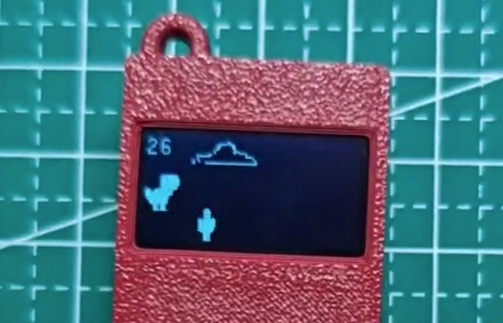

# Tiny Dino Game on CH32V003 Game Console



Dino Game for CH32V003 Game Console, based on wokwi project https://wokwi.com/projects/346178932556431954, ported by ohdarling.

## CH32V003 Game Console

The CH32V003 Game Console project was originally developed by wagiminator, and the repository can be found at https://github.com/wagiminator/CH32V003-GameConsole .

## Modified Tiny Game Console

A modified version can be found at https://oshwhub.com/wandaeda/ji-yu-ch32v003-de-yue-chi-kou-you-xi-ji .


## How to flash

```bash
wlink flash --address 0x8000000 ./binaries/tiny_dino.bin
```
